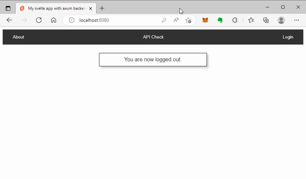
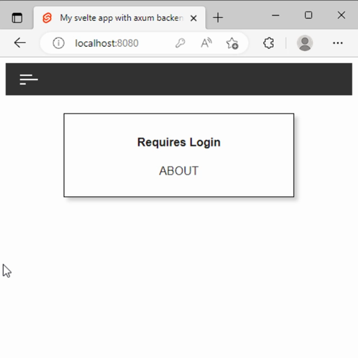

# New Version 0.4.0
- updated to `axum` 0.6
  - changes to State usage; how its setup with route and called from middleware
  - changes to ordering of parameters in functions; last parameter can consume request body
  - eliminated `axum::extract::RequestParts` with help from update on `axum-sessions`
- updated to `axum-sessions` 0.4 to match
- incremented `tokio` version to 1.24
- old `axum` 0.5 version is kept under branch `v0.3_Axum0.5`

# New Version 0.3.0
- switched to using Vite as per current template setup from svelte [https://svelte.dev/](https://svelte.dev/)
- changed directory structure with ./front_end/public and location of index.html
- modified backend to use `./front_end/dist` for static serve - location of `npm run build`
- cleaned up css and added app.css and global css

# Help
- If anyone has ideas of how to implement a build file that would handle the npm script build on the front end and the rust cargo run together, let me know.

# svelte-axum-project

Starting project template for Rust Axum backend and Svelte frontend.

Created from a similar idea as [svelte-tide-project](https://github.com/jbertovic/svelte-tide-project)

# Template
## Using Cargo
- Must have cargo generate installed: `cargo install cargo-generate`
- Then use `cargo generate jbertovic/svelte-axum-project -n <your-project-name>`

## Using git template
- you can also just hit the "use this template" button in green on top of the repo
- if you have gh cli installed check out `--template` option

# Back end - Rust Axum
- located in `./back_end`
- serves front end directory
- middleware for checking authorization header
- middleware for checking session that user exists
- store example that holds token secret for authorization
- /api route example using authorization header
- /secure route example using sessions for authorization

Note there is no persistance beyond what's held in memory while the application is running

run as `cargo run` from parent directory and not needed to run inside `./back_end` folder

# Front end - Svelte
- Located in `./front_end`
- navbar with login and logout
- secure page that shows session information once logged in
- api fetch example, log in not required

run as `npm run build` from inside the `./front_end` directory to build the static serve file directory.

# Setup

Install the following
NodeJs - [Install](https://nodejs.org/en/download/)
Rust  - [Install](https://www.rust-lang.org/tools/install)

Clone the repository
- cd repository
- inside the `./front_end` folder run `npm install` to download all module dependencies inside root directory of project
- inside the `./front_end` folder run `npm run build` to bundle the js/svelte code into public folder
- inside the top level folder run `cargo run` to start the the server
- access in browser at http://localhost:8080/
